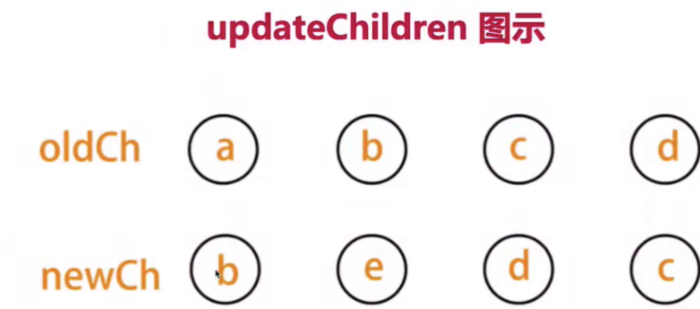
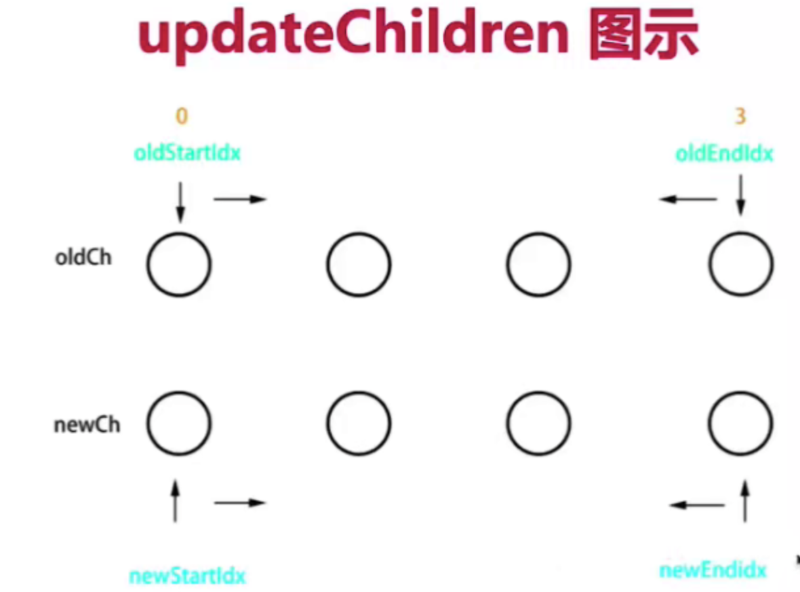
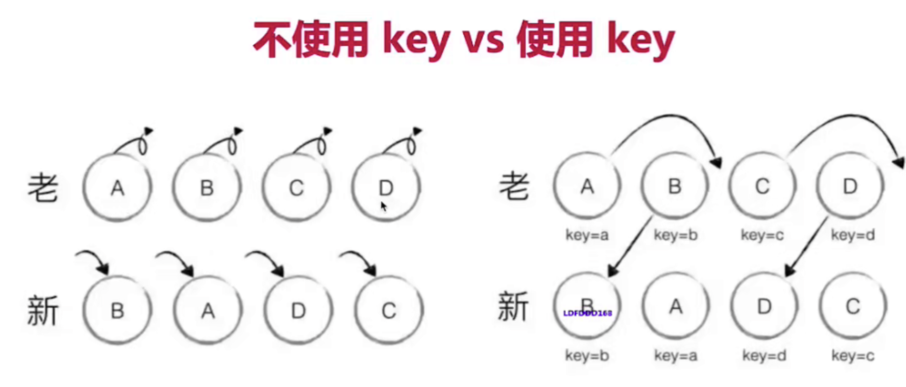

# 深入diff 算法 源码

+ 生成 vnode

+ patch 函数
+ patchVnode 函数
+ updateChildren 函数


## 生成 vnode

### `snabbdom/h`

```js
import { h } from 'snabbdom/h'

var vnode = h('div', { style: { color: '#000' } }, [
  h('h1', 'Headline'),
  h('p', 'A paragraph'),
])
```

h方法：

```ts
// h.ts
export function h (sel: any, b?: any, c?: any): VNode {
  var data: VNodeData = {}
  var children: any
  var text: any
  var i: number
  if (c !== undefined) {
    if (b !== null) {
      data = b
    }
    if (is.array(c)) {
      children = c
    } else if (is.primitive(c)) {
      text = c
    } else if (c && c.sel) {
      children = [c]
    }
  } else if (b !== undefined && b !== null) {
    if (is.array(b)) {
      children = b
    } else if (is.primitive(b)) {
      text = b
    } else if (b && b.sel) {
      children = [b]
    } else { data = b }
  }
  if (children !== undefined) {
    for (i = 0; i < children.length; ++i) {
      if (is.primitive(children[i])) children[i] = vnode(undefined, undefined, undefined, children[i], undefined)
    }
  }
  if (
    sel[0] === 's' && sel[1] === 'v' && sel[2] === 'g' &&
    (sel.length === 3 || sel[3] === '.' || sel[3] === '#')
  ) {
    addNS(data, children, sel)
  }
  // 注意：这里返回了 vnode 这个方法，我们找一下 vnode()
  return vnode(sel, data, children, text, undefined)
};
```

vnode方法：

```ts
export function vnode (sel: string | undefined,
  data: any | undefined,
  children: Array<VNode | string> | undefined,
  text: string | undefined,
  elm: Element | Text | undefined): VNode {
  const key = data === undefined ? undefined : data.key
  return { sel, data, children, text, elm, key }
}
```

看的出来 vnode 其实就是整个了一个对象返回给了 h 函数，所以h函数也会返回这个vnode返回出去的对象。


### `snabbdom/tovnode`

```js
import { init } from 'snabbdom/init'
import { classModule } from 'snabbdom/modules/class'
import { propsModule } from 'snabbdom/modules/props'
import { styleModule } from 'snabbdom/modules/style'
import { eventListenersModule } from 'snabbdom/modules/eventlisteners'
import { h } from 'snabbdom/h' // helper function for creating vnodes
import { toVNode } from 'snabbdom/tovnode'

var patch = init([ // Init patch function with chosen modules
  classModule, // makes it easy to toggle classes
  propsModule, // for setting properties on DOM elements
  styleModule, // handles styling on elements with support for animations
  eventListenersModule, // attaches event listeners
])

var newVNode = h('div', { style: { color: '#000' } }, [
  h('h1', 'Headline'),
  h('p', 'A paragraph'),
])

patch(toVNode(document.querySelector('.container')), newVNode)
```


## patch 函数

patch 函数

```ts
return function patch (oldVnode: VNode | Element, vnode: VNode): VNode {
    let i: number, elm: Node, parent: Node
    const insertedVnodeQueue: VNodeQueue = []
    // 执行 pre hook（lifecycle） 
    for (i = 0; i < cbs.pre.length; ++i) cbs.pre[i]()
  
		// 第一个参数不是 vnode，比如是个dom 元素 ： patch(container, newVnode)
    if (!isVnode(oldVnode)) {
      // 创建一个空的 vnode, 关联到这个DOM元素
      oldVnode = emptyNodeAt(oldVnode)
    }
		// 相同的 vnode key 和 sel 都相等
    if (sameVnode(oldVnode, vnode)) {
      patchVnode(oldVnode, vnode, insertedVnodeQueue)
    } 
  	// 不同的 vnode，直接删掉重建
  	else {
      elm = oldVnode.elm!
      parent = api.parentNode(elm) as Node
			// 重建
      createElm(vnode, insertedVnodeQueue)

      if (parent !== null) {
        api.insertBefore(parent, vnode.elm!, api.nextSibling(elm))
        removeVnodes(parent, [oldVnode], 0, 0)
      }
    }

    for (i = 0; i < insertedVnodeQueue.length; ++i) {
      insertedVnodeQueue[i].data!.hook!.insert!(insertedVnodeQueue[i])
    }
    for (i = 0; i < cbs.post.length; ++i) cbs.post[i]()
    return vnode
  }


// emptyNodeAt 也是返回一个 vnode 对象，就是将传入的这个 elm 与做出来的 vnode 做绑定
function emptyNodeAt (elm: Element) {
    const id = elm.id ? '#' + elm.id : ''
    const c = elm.className ? '.' + elm.className.split(' ').join('.') : ''
    return vnode(api.tagName(elm).toLowerCase() + id + c, {}, [], undefined, elm)
  }
```


sameVnode 方法（证明形同的selector、key， 时间复杂度为 O(n)）

```ts
function sameVnode (vnode1: VNode, vnode2: VNode): boolean {
  // key 和 sel 都相等
  // 如果不传key 呢？ undefined  === undefined // true
  return vnode1.key === vnode2.key && vnode1.sel === vnode2.sel
}
```


## patchVnode - vnode 对比

patchVnode

```ts
function patchVnode (oldVnode: VNode, vnode: VNode, insertedVnodeQueue: VNodeQueue) {
    // 执行 prepatch hook
    const hook = vnode.data?.hook
    hook?.prepatch?.(oldVnode, vnode)
    // 设置 vnode.elem
    const elm = vnode.elm = oldVnode.elm!
    // 旧 children
    const oldCh = oldVnode.children as VNode[]
    // 新 children
    const ch = vnode.children as VNode[]
    
    if (oldVnode === vnode) return
    // hook 相关
    if (vnode.data !== undefined) {
      for (let i = 0; i < cbs.update.length; ++i) cbs.update[i](oldVnode, vnode)
      vnode.data.hook?.update?.(oldVnode, vnode)
    }
    // vnode.text === undefined (vnode.children(一般有值) !== undefined)
    if (isUndef(vnode.text)) {
      // 新旧都有 children
      if (isDef(oldCh) && isDef(ch)) {
        // 对比两个children
        if (oldCh !== ch) updateChildren(elm, oldCh, ch, insertedVnodeQueue)
      // 新 children 有，旧children 无，（旧 text 有）
      } else if (isDef(ch)) {
        // 清空 text
        if (isDef(oldVnode.text)) api.setTextContent(elm, '')
        // 添加 children
        addVnodes(elm, null, ch, 0, ch.length - 1, insertedVnodeQueue)
      // 旧 child 有， 新 child 无
      } else if (isDef(oldCh)) {
        // 移除 children
        removeVnodes(elm, oldCh, 0, oldCh.length - 1)
      // 旧 text 有
      } else if (isDef(oldVnode.text)) {
        // 清空
        api.setTextContent(elm, '')
      }
      
    // else : vnode.text !== undefined (vnode.children 无值)
    } else if (oldVnode.text !== vnode.text) {
      // 移除 旧 ch
      if (isDef(oldCh)) {
        removeVnodes(elm, oldCh, 0, oldCh.length - 1)
      }
      // 然后再设置新的 text
      api.setTextContent(elm, vnode.text!)
    }
    hook?.postpatch?.(oldVnode, vnode)
  }
```

addVnodes方法

```ts
function addVnodes (
    parentElm: Node,
    before: Node | null,
    vnodes: VNode[],
    startIdx: number,
    endIdx: number,
    insertedVnodeQueue: VNodeQueue
  ) {
    for (; startIdx <= endIdx; ++startIdx) {
      const ch = vnodes[startIdx]
      if (ch != null) {
        api.insertBefore(parentElm, createElm(ch, insertedVnodeQueue), before)
      }
    }
  }
```

removeVnodes 方法

```ts
function removeVnodes (parentElm: Node,
    vnodes: VNode[],
    startIdx: number,
    endIdx: number): void {
    for (; startIdx <= endIdx; ++startIdx) {
      let listeners: number
      let rm: () => void
      const ch = vnodes[startIdx]
      if (ch != null) {
        if (isDef(ch.sel)) {
          invokeDestroyHook(ch) // hook 操作 destroy
          // 移除 DOM 元素
          listeners = cbs.remove.length + 1
          rm = createRmCb(ch.elm!, listeners)
          for (let i = 0; i < cbs.remove.length; ++i) cbs.remove[i](ch, rm)
          const removeHook = ch?.data?.hook?.remove
          if (isDef(removeHook)) {
            removeHook(ch, rm)
          } else {
            rm()
          }
        } else { // Text node
          api.removeChild(parentElm, ch.elm!)
        }
      }
    }
  }
```


## updateChildren - 对比两个children

updateChildren 函数

```ts
function updateChildren (parentElm: Node,
    oldCh: VNode[],
    newCh: VNode[],
    insertedVnodeQueue: VNodeQueue) {
    let oldStartIdx = 0
    let newStartIdx = 0
    let oldEndIdx = oldCh.length - 1
    let oldStartVnode = oldCh[0]
    let oldEndVnode = oldCh[oldEndIdx]
    let newEndIdx = newCh.length - 1
    let newStartVnode = newCh[0]
    let newEndVnode = newCh[newEndIdx]
    let oldKeyToIdx: KeyToIndexMap | undefined
    let idxInOld: number
    let elmToMove: VNode
    let before: any

    while (oldStartIdx <= oldEndIdx && newStartIdx <= newEndIdx) {
      if (oldStartVnode == null) {
        oldStartVnode = oldCh[++oldStartIdx] // Vnode might have been moved left
      } else if (oldEndVnode == null) {
        oldEndVnode = oldCh[--oldEndIdx]
      } else if (newStartVnode == null) {
        newStartVnode = newCh[++newStartIdx]
      } else if (newEndVnode == null) {
        newEndVnode = newCh[--newEndIdx]
        // 开始和开始去对比，sameVnode 返回 key & sel 是否相同，加快了 updateChildren的对比高效
      } else if (sameVnode(oldStartVnode, newStartVnode)) {
        patchVnode(oldStartVnode, newStartVnode, insertedVnodeQueue)
        oldStartVnode = oldCh[++oldStartIdx]
        newStartVnode = newCh[++newStartIdx]
        // 结束和结束去对比
      } else if (sameVnode(oldEndVnode, newEndVnode)) {
        patchVnode(oldEndVnode, newEndVnode, insertedVnodeQueue)
        oldEndVnode = oldCh[--oldEndIdx]
        newEndVnode = newCh[--newEndIdx]
        // 开始和结束对比
      } else if (sameVnode(oldStartVnode, newEndVnode)) { // Vnode moved right
        patchVnode(oldStartVnode, newEndVnode, insertedVnodeQueue)
        api.insertBefore(parentElm, oldStartVnode.elm!, api.nextSibling(oldEndVnode.elm!))
        oldStartVnode = oldCh[++oldStartIdx]
        newEndVnode = newCh[--newEndIdx]
        // 结束和开始去对比
      } else if (sameVnode(oldEndVnode, newStartVnode)) { // Vnode moved left
        patchVnode(oldEndVnode, newStartVnode, insertedVnodeQueue)
        api.insertBefore(parentElm, oldEndVnode.elm!, oldStartVnode.elm!)
        oldEndVnode = oldCh[--oldEndIdx]
        newStartVnode = newCh[++newStartIdx]
        // 以上四个都没命中
      } else {
        if (oldKeyToIdx === undefined) {
          oldKeyToIdx = createKeyToOldIdx(oldCh, oldStartIdx, oldEndIdx)
        }
        // 拿 新节点的key 能否对应上 OldCh中的某个节点的key 是否能对应上
        idxInOld = oldKeyToIdx[newStartVnode.key as string]
        // 没对应上
        if (isUndef(idxInOld)) { // New element 重建
          api.insertBefore(parentElm, createElm(newStartVnode, insertedVnodeQueue), oldStartVnode.elm!)
        // 对应上了
        } else {
          // 对应上 key 的节点
          elmToMove = oldCh[idxInOld]
          // sel 是否相等 （sameVnode 的条件）
          if (elmToMove.sel !== newStartVnode.sel) {
            // New Element
            api.insertBefore(parentElm, createElm(newStartVnode, insertedVnodeQueue), oldStartVnode.elm!)
            // sel & key 相等
          } else {
            // 相等之后去 patch vnode
            patchVnode(elmToMove, newStartVnode, insertedVnodeQueue)
            oldCh[idxInOld] = undefined as any
            api.insertBefore(parentElm, elmToMove.elm!, oldStartVnode.elm!)
          }
        }
        newStartVnode = newCh[++newStartIdx]
      }
    }
    if (oldStartIdx <= oldEndIdx || newStartIdx <= newEndIdx) {
      if (oldStartIdx > oldEndIdx) {
        before = newCh[newEndIdx + 1] == null ? null : newCh[newEndIdx + 1].elm
        addVnodes(parentElm, before, newCh, newStartIdx, newEndIdx, insertedVnodeQueue)
      } else {
        removeVnodes(parentElm, oldCh, oldStartIdx, oldEndIdx)
      }
    }
  }
```








## diff 算法总结

+ patchVnode
+ addVnodes removeVnodes
+ updateChildren (key 的重要性) -- v-for中为什么使用 key


## vdom 和 diff 总结

+ 细节不重要， updateChildren 的过程也不重要，不要深究
+ vdom核心概念很重要：h、vnode、patch、diff、key等
+ vdom 存在的价值更加重要：数据驱动视图，控制DOM操作