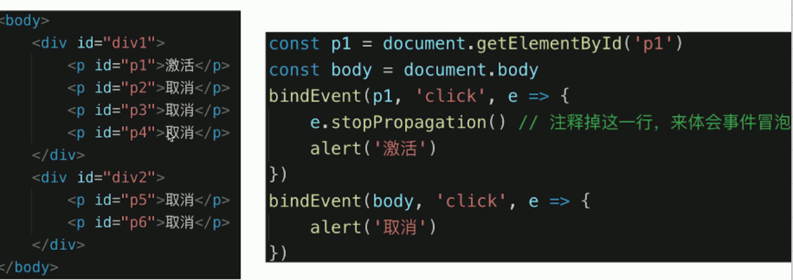
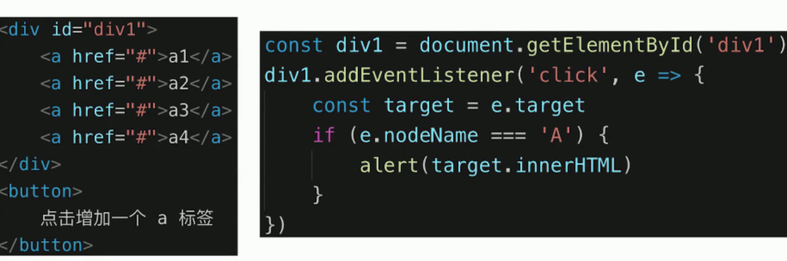
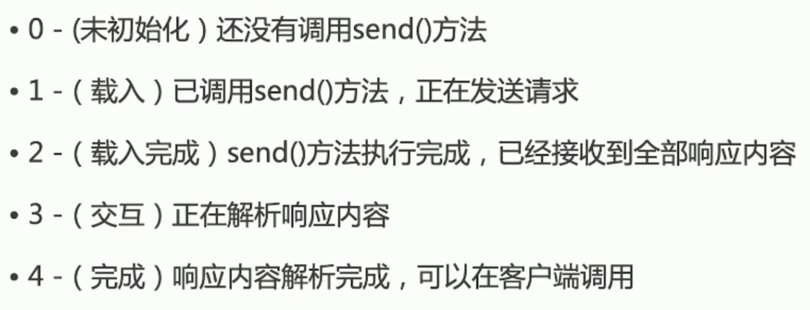
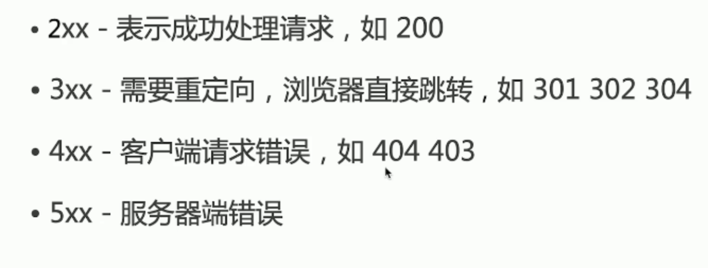
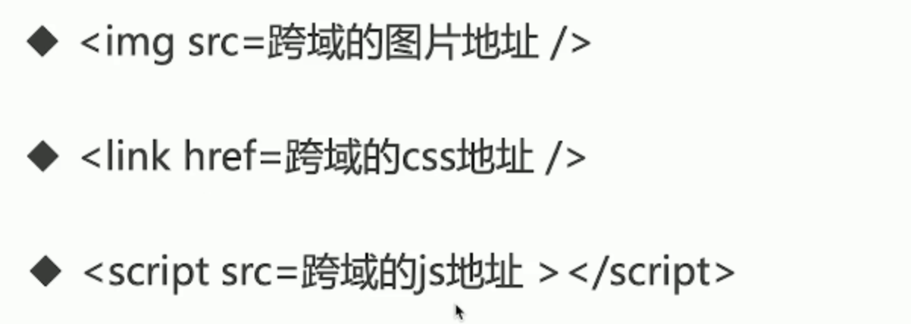
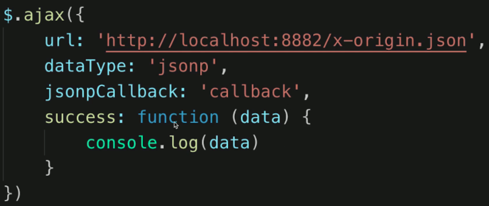
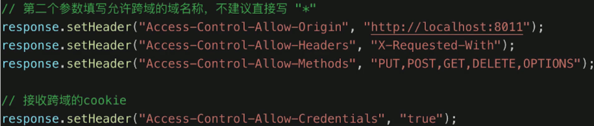

# JS-Web-API


+ JS基础知识，规定语法（ECMA262标准）
+ JSWebAPI，网页操作的API（W3C标准）
+ 前者是后者的基础，两者结合才能真正实际应用


### Content

+ DOM
+ BOM
+ 事件绑定
+ ajax
+ 存储


## DOM

**前言**

+ vue 和 React 框架应用广泛，封装了DOM操作
+ 但DOM操作一直都是前端工程师的基础、必备知识
+ 只会vue 而不懂DOM操作的前端，不会长久

**注重基础**


### DOM操作（Document Object Model）

+ DOM本质
+ DOM节点操作
+ DOM结构操作
+ DOM性能


#### DOM本质

类似Xml html

DOM本质是一颗树


#### DOM节点操作

+ 获取DOM节点

  ```js
  const div1 = document.getElementById('div1') // 元素
  const divList = document.getElementByTagName('div') // 集合
  console.log(diconsole.log()
  console.log(divList[0])
  const containerList = document.getElementByClassName('.container') // 集合
  const pList = document.querySelectorAll('p') // 集合
  ```

+ attribute ：修改html属性，会改变html结构


+ property ： 修改对象属性，不会体现到html结构中


##### attribute & property

+ attribute ：修改html属性，会改变html结构
+ property ： 修改对象属性，不会体现到html结构中
+ 两者都有可能引起DOM重新渲染


#### DOM 结构操作

+ 新增/插入节点


+ 获取子元素列表，获取父元素


+ 删除节点


### DOM性能

+ DOM操作非常昂贵，避免频繁的DOM操作
+ 对DOM查询做缓存
+ 将频繁操作改为一次性操作


#### DOM查询做缓存


#### 将频繁操作改为一次性操作


## topic

+ DOM是哪种数据结构 - 树（DOM树）
+ DOM操作的常用API
  + DOM节点操作
  + DOM结构操作
  + attr & property
+ attr 和 property 的区别
  + attribute ：修改html属性，会改变html结构
  + property ： 修改对象属性，不会体现到html结构中 (先考虑这个)
  + 两者都有可能引起DOM重新渲染
+ 一次性插入多个DOM节点，考虑性能（重点）
  + frag
  + 做缓存


## BOM操作(Browser Object Model)

+ 如何识别浏览器的类型


+ 分析拆解 url 各个部分


### content

+ navigator
+ screen
+ location
+ history


#### navigator 和 screen


#### location 和 history


## 事件

+ 事件绑定
+ 事件冒泡
+ 事件代理


#### 事件绑定

```js
const byn = document.getElementById('btn1')
btn.addEventListener('click', event => {
  console.log('clicked')
})
```

##### 通用的绑定函数

```js
function bindEvent(elem, type, fn) {
    elem.addEventLister(type, fn)
}
const a = document.getElementById('link1')
bindEvent(a, 'click', (e) => {
    e.preventDefault() // 阻止默认行为
    alert('clicked')
})
```


#### 事件冒泡




#### 事件代理

> 场景：瀑布流



+ 代码简洁
+ 减少浏览器内存占用

```js

function bindEventProxy(elem, type, selector, fn) {
    if (fn == null) {
        fn = selector
        selector = null
    }
    elem.addEventListener(type, event => {
        const target = event.target
        if (selector) {
            // 代理
            if (target.matches(selector)) {
                fn.call(target, event)
            }
        } else {
            // 普通绑定
            fn.call(target, event)
        }
    })
}
```


### topic

+ 编写一个通用的事件监听函数

  ```js
  
  function bindEventProxy(elem, type, selector, fn) {
      if (fn == null) {
          fn = selector
          selector = null
      }
      elem.addEventListener(type, event => {
          const target = event.target
          if (selector) {
              // 代理
              if (target.matches(selector)) {
                  fn.call(target, event)
              }
          } else {
              // 普通绑定
              fn.call(target, event)
          }
      })
  }
  ```

  

+ 描述事件冒泡的流程

  + 基于DOM树形结构
  + 事件会顺着触发元素向上冒泡
  + 应用场景：代理

  

+ 无线下拉的图片列表，如何监听每个图片的点击？

  + 事件代理
  + 用 e.target 获取触发元素
  + 用matches 来判断是否是触发元素


## ajax


+ XMLHttpRequest
+ 状态码
+ 跨域：同源策略，跨域解决方案


### XMLHttpRequest

##### xhr.readyState



##### xhr.status




### 跨域

+ 什么是跨域（同源策略）
+ JSONP
+ CORS（服务端支持）


#### 同源策略

+ ajax 请求时，浏览器要求当前网页和 server 必须同源（安全）
+ 同源：协议、域名、端口，三者必须一致


##### 加载图片 css js 可无视同源策略



+  可用于统计打点，可使用第三方统计服务

+ <link /> <script> 可使用 CDN ,CDN 一般是外域

+ <script> 可实现JSONP


#### 跨域

+ 所有的跨域，都必须经过 server 端允许和配合
+ 未经 server 端允许就实现跨域，说明浏览器有漏洞，危险信号


#### JSONP

+ 访问 https://www.baidu.com ，服务端一定返回一个 html 文件吗？
+ 服务器可以任意动态拼接数据返回
+ 所以，<script> 就可以获得跨域的数据，只要服务端愿意返回


##### jQuery 实现 jsonp




#### CORS - 服务器设置 http header




### 常见的ajax 库

+ $.ajax()
+ fetch()
+ axios


### topic

+ 手写一个ajax

```js

// ajax
const xhr = new XMLHttpRequest()

xhr.open('GET', "/api", true)

xhr.onreadystatechange = function() {
    // 这里的函数异步执行
    if (xhr.readyState === 4) {
        if (xhr.status === 200) {
            alert(xhr.responseText)
        }
    }
}

xhr.send(null)

xhr.open('POST', '/login', true) // true 是否异步

const postData = {
    username: 'terry',
    password: '123'
}

xhr.send(JSON.stringify(postData))
```

+ promise 实现

```js
// promise 实现 ajax
function ajax(url) {
    return new Promise((resolve, reject) => {
        const xhr = new XMLHttpRequest()
        xhr.open('GET', url, true)

        xhr.onreadystatechange = function () {
            if (xhr.readyState === 4) {
                if (xhr.status === 200) {
                    resolve(JSON.parse(xhr.responseText))
                } else if (xhr.status = 404) {
                    reject(new Error('404 not found'))
                }
            }
        }
        xhr.send(null)
    })
}
const url = '/data/test.json'
ajax(url)
.then(res => console.log(res))
.catch(e => console.error(e))
```


+ 跨域的常用实现方式
  + JSONP
  + CORS（server）
  + 代理


## 存储

+ cookie
+ sessionStorage
+ localStorage


#### 三者区别

+ 容量
+ API易用性
+ 是否跟随 http 请求发送出去

