# JS-Web-API


+ JS基础知识，规定语法（ECMA262标准）
+ JSWebAPI，网页操作的API（W3C标准）
+ 前者是后者的基础，两者结合才能真正实际应用


### Content

+ DOM
+ BOM
+ 事件绑定
+ ajax
+ 存储


## DOM

**前言**

+ vue 和 React 框架应用广泛，封装了DOM操作
+ 但DOM操作一直都是前端工程师的基础、必备知识
+ 只会vue 而不懂DOM操作的前端，不会长久

**注重基础**


### DOM操作（Document Object Model）

+ DOM本质
+ DOM节点操作
+ DOM结构操作
+ DOM性能


#### DOM本质

类似Xml html

DOM本质是一颗树


#### DOM节点操作

+ 获取DOM节点

  ```js
  const div1 = document.getElementById('div1') // 元素
  const divList = document.getElementByTagName('div') // 集合
  console.log(diconsole.log()
  console.log(divList[0])
  const containerList = document.getElementByClassName('.container') // 集合
  const pList = document.querySelectorAll('p') // 集合
  ```

+ attribute ：修改html属性，会改变html结构

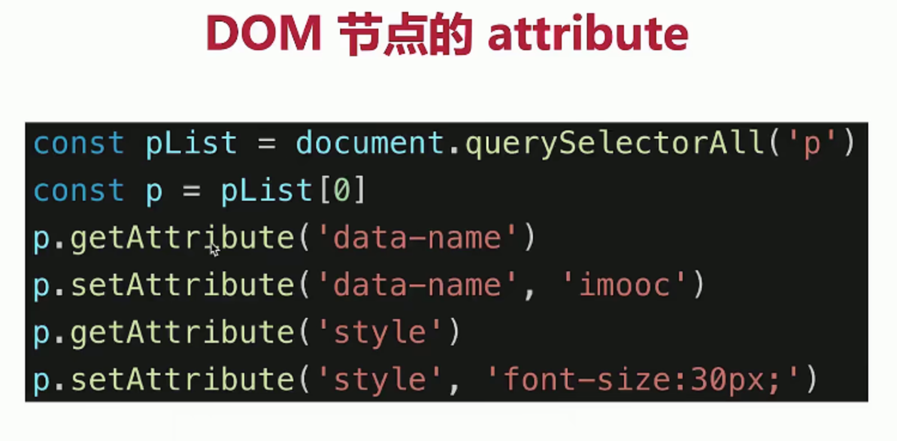

+ property ： 修改对象属性，不会体现到html结构中

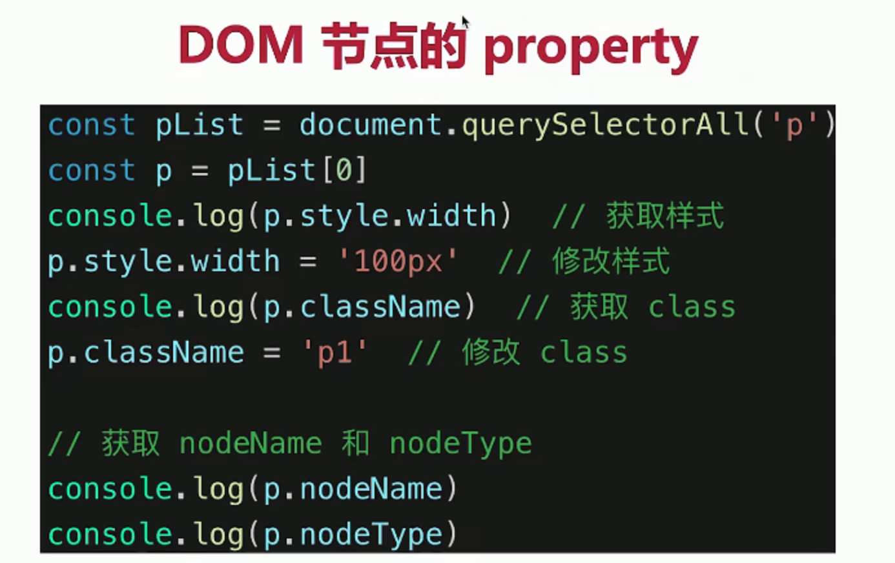


##### attribute & property

+ attribute ：修改html属性，会改变html结构
+ property ： 修改对象属性，不会体现到html结构中
+ 两者都有可能引起DOM重新渲染


#### DOM 结构操作

+ 新增/插入节点

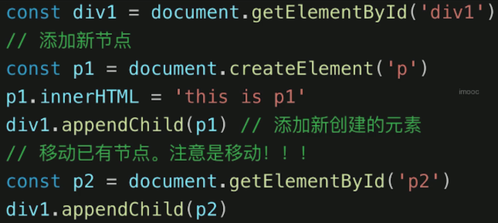

+ 获取子元素列表，获取父元素

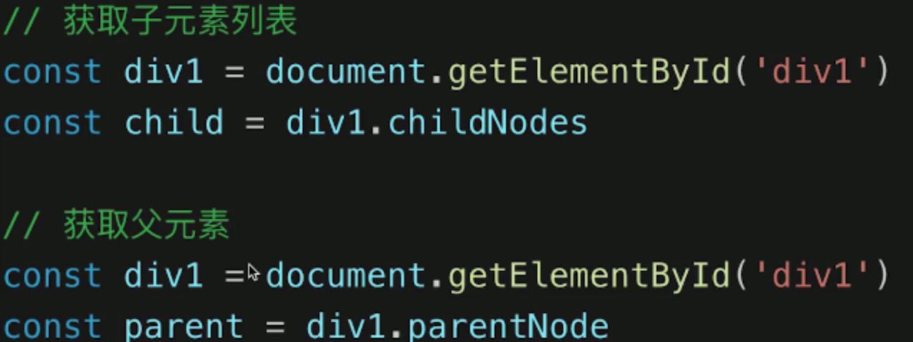


+ 删除节点

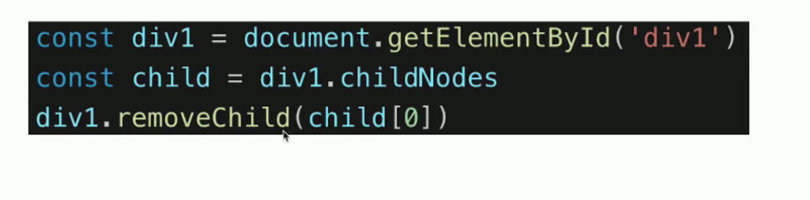

### DOM性能

+ DOM操作非常昂贵，避免频繁的DOM操作
+ 对DOM查询做缓存
+ 将频繁操作改为一次性操作


#### DOM查询做缓存

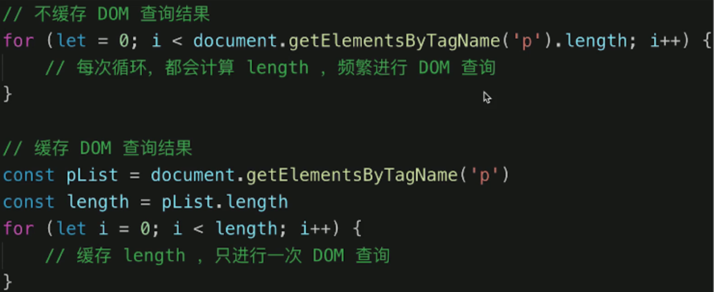


#### 将频繁操作改为一次性操作

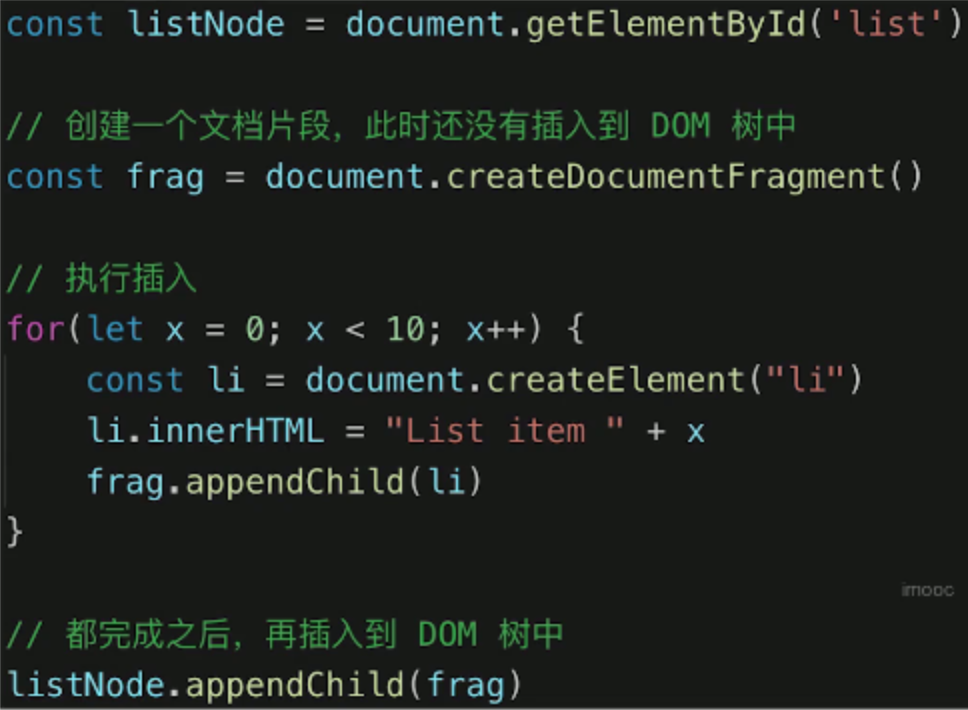


## topic

+ DOM是哪种数据结构 - 树（DOM树）
+ DOM操作的常用API
  + DOM节点操作
  + DOM结构操作
  + attr & property
+ attr 和 property 的区别
  + attribute ：修改html属性，会改变html结构
  + property ： 修改对象属性，不会体现到html结构中 (先考虑这个)
  + 两者都有可能引起DOM重新渲染
+ 一次性插入多个DOM节点，考虑性能（重点）
  + frag
  + 做缓存


## BOM操作(Browser Object Model)

+ 如何识别浏览器的类型

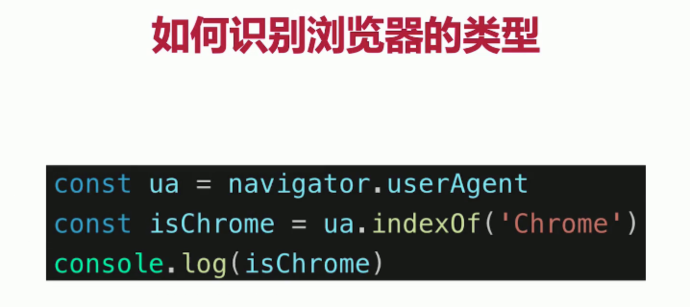

+ 分析拆解 url 各个部分

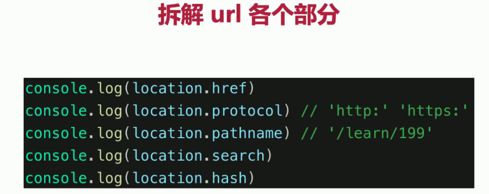


### content

+ navigator
+ screen
+ location
+ history


#### navigator 和 screen

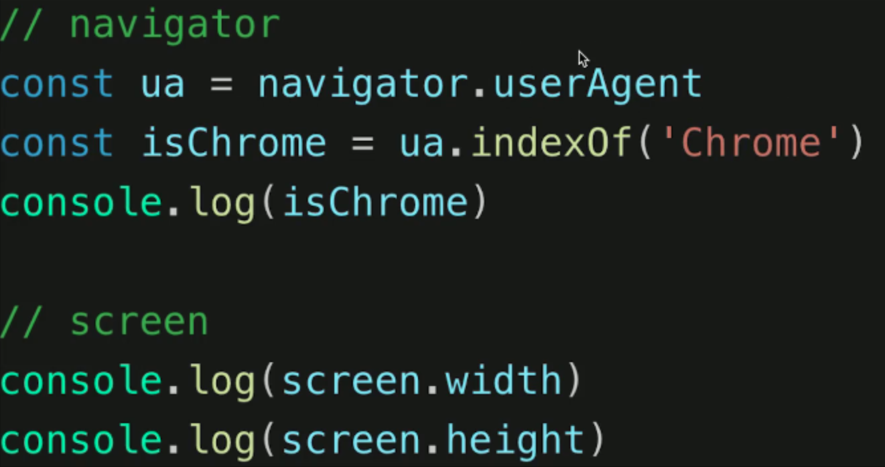


#### location 和 history

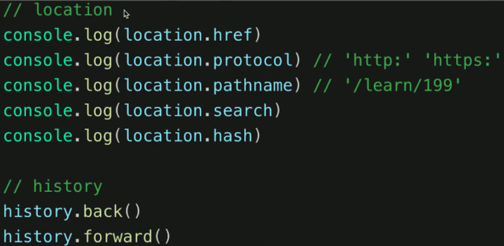


