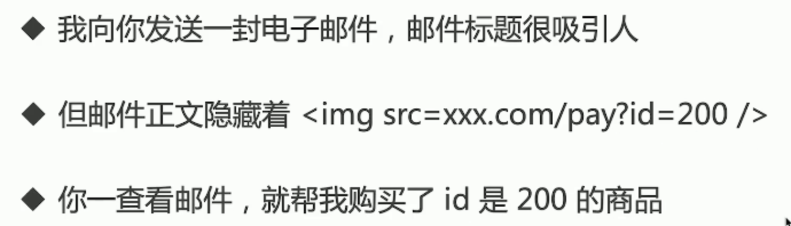

# 运行环境

+ 网页加载过程
+ 性能优化
+ 安全


## 网页加载过程

### content

+ 加载资源的形式
+ 加载资源的过程
+ 渲染页面的过程


#### 加载资源的形式

+ html代码
+ 媒体文件，如图片、视频等
+ javascript css


#### 加载资源的过程

+ DNS资源：域名 -> IP地址
+ 浏览器根据IP地址向服务器发起 http 请求
+ 服务器处理http请求，并返回给浏览器


#### 渲染页面的过程

+ 根据 HTML 代码生成 DOM Tree
+ 根据CSS 代码 生成 CSSOM
+ 将DOM Tree 和 CSSOM 整合成 Render Tree

+ 根据 Render Tree 渲染页面
+ 遇到 <script> 则暂停渲染，优先加载并执行 JS 代码，完成再继续
+ 直至把 Render Tree 渲染完成


### topic

+ 从 输入 url 到渲染出页面的整个过程
  + 下载资源：各个资源类型，下载过程
  + 渲染页面：结合html css javascript 图片等

+ window.onload 和 DOMContentLoaded 的区别 
  + window.onload 资源全部加载完才能执行，包括图片
  + DOMContentLoaded DOM 渲染完成即可，图片可能尚未下载

```js
window.addEventListener('load', function() {
  // 页面的全部资源加载完成才会执行，包括图片、资源等
})
document.addEventListener('DOMContentLoaded', function() {
  // DOM 渲染完即可执行，此时图片、视频还可能没有加载完
})
```


## 前端性能优化

#### 性能优化原则

+ 多使用内存、缓存或其他方法
+ 减少CPU计算量，减少网络加载耗时

（适用于所有编程的性能优化 -- **空间换时间**）


#### 从何入手

+ 让加载更快
+ 让渲染更快


##### 让加载更快

+ 减少资源体积：压缩代码
+ 减少访问次数：合并代码，SSR 服务端渲染，缓存
  + 缓存
    + 静态资源加 hash 后缀，根据文件内容计算 hash
    + 文件内容不变，则hash 不变，则url 不变
    + url 和文件不变，则会自动触发 http 缓存机制，返回 304
  + SSR
    + 服务端渲染：将网页和数据一起加载，一起渲染
    + 非SSR(前后端分离)：先加载网页，再加载数据，再渲染数据
    + 早先的JSP ASP PHP ，现在的vue -  nuxt， react -next  
+ 使用更快的网络：CDN
  + 引用 bootstrap、jquery


##### 让渲染更快

+ CSS放在 head ，JS 放在 body 最下面

+ 尽早开始执行JS ，用DOMContentLoaded 触发

+ 懒加载（图片懒加载，上滑加载更多）

  ```html
  
  <script>
  	var img1 = document.getElementById('img1')
    img1.src = img1.getAttribute('data-realsrc')
  </script>
  ```

  

+ 对DOM 查询进行缓存 - （缓存 length）

  ```js
  // 不缓存 DOM 查询结果
  for (let i = 0; i < document.getElementsByTagName('p').length; i++) {
    // 每次循环，都会计算 length，频繁进行DOM 查询
  }
  
  // 缓存 DOM 查询结果
  const pList = document.getElementsByTagName('p')
  const len = pList.length
  for (let i = 0; i < len; i ++) {
    // 缓存length，只进行一次DOM查询
  }
  ```

+ 频繁DOM 操作，合并到一起插入DOM结构 

  ```js
  const listNode = document.getELementById('list')
  // 创建一个文本片段，此时还没有插入到DOM 树种
  const frag = document.createDocumentFragment()
  // 执行插入
  for (let x = 0; x < 10; x++) {
    const li = document.createElement('li')
    li.innerHTML = " List Item" + x
    frag.appendChild(li)
  }
  // 都完成之后，再插入到 DOM 数中
  listNode.appendCHild(frag)
  ```

+ 节流 throttle 防抖 debounce


#### 防抖 debounce

+ 监听一个输入框，文字变化后触发 change 事件
+ 直接用 keyup 事件，则会频发触发 change 事件
+ 防抖：用户输入结束或暂停时，才会触发 change 事件

```js
function debounce(fn, delay = 500) {
    let timer = null
    return function() {
        if (timer) {
            clearTimeout(timer)
        }
        timer = setTimeout(() => {
            fn.apply(this, arguments)
            timer = null
        }, delay)
    }
}
```


#### 节流 throttle

+ 拖拽一个元素时，要随时拿到该元素被拖拽的位置
+ 直接用 drag 事件，则会频繁触发，很容易导致卡顿
+ 节流：无论拖拽速度多快，都会每隔 100 ms 触发一次

```js
function throttle(fn, delay = 500) {
    let timer = null
    return function() {
        if (timer) {
            return //! 注意这里
        }
        timer = setTimeout(() => {
            fn.apply(this, arguments)
            timer = null
        }, delay)
    }
}
```


## 安全

+ XSS 跨站请求攻击
+ XSRF 跨站请求伪造


#### XSS攻击


**document.cookie 获取cookie**

```html
<script>
alert(document.cookie)
</script>
```

#### XSS 预防

+ 替换特殊字符，如 `<` 换为`$lt;`，`>` 换位 `&gt;`

+ <script> 变为  `$lt;script&gt;`，直接显示，而不会作为脚本执行

+ 前后端都这换，以防万一


#### XSRF 攻击




#### XSRF 预防

+ 使用 post 接口
+ 增加验证，例如密码、短信验证码、面容等


### topic

+ 常见的web前端攻击方式有哪些？
  + XSS
  + XSRF


