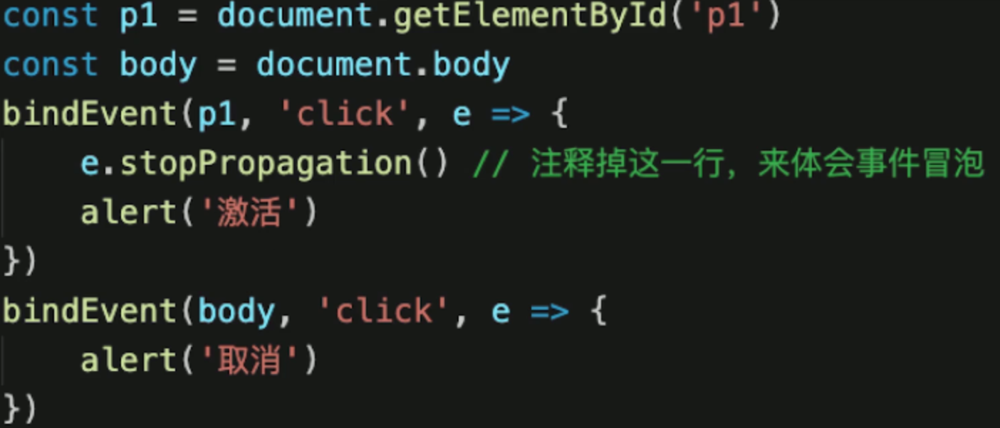
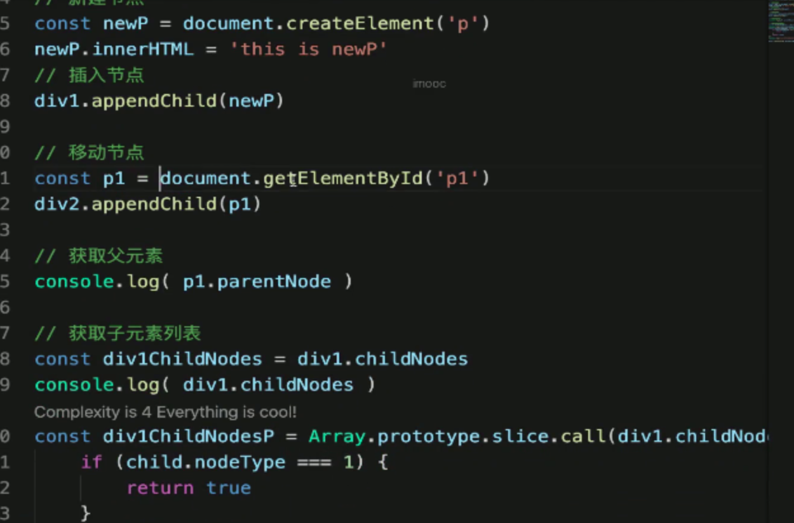
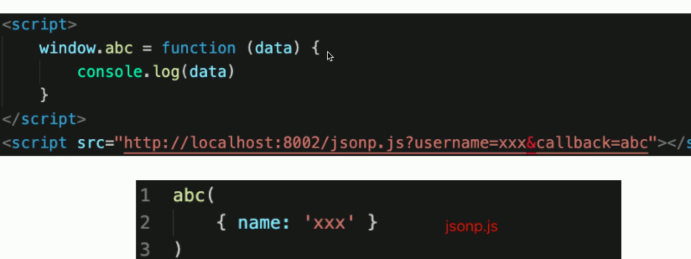

1. var 和 let const 的区别
   + var 是 ES5 语法，let const 是 ES6 语法，var 有变量提升
   + var 和 let 是变量，可修改；const 是变量，不可修改
   + let const 有块级作用域，var 没有


2. typeof 返回哪些类型
   + 值类型：undefined string number boolean symbol
   + 函数：function
   + object（注意，typeof null === 'object'）


3. 列举强制类型转换和隐式类型转换 

   + 强制：parseInt parseFloat toString 等
   + 隐式：if  、逻辑运算、 == 、 +拼接字符串

4. 手写深度比较，模拟 lodash isEqual

   

5. split() 和 join 的区别

   ```js
   '1-2-3'.split('-') // [1, 2, 3]
   [1, 2, 3].join('-') // '1-2-3'
   ```

   

6. 数组的 pop push unshift shift 分别是什么

   + 功能是什么？
   + 返回值是什么？
   + 是否会对原数组造成影响？

   **拓展：数组的API 有哪些是纯函数**

   **纯函数：1.不改变原数组（没有副作用） 2. 返回一个新的数组**

   + concat
   + map
   + filter
   + slice  - 拷贝


7. 数组 slice 和 splice 的区别

   + 功能区别（slice - 切片 ， splice - 剪接）
   + 参数和返回值
   + 是否是纯函数

   

8. [10, 20, 30].map(parseInt) 返回结果是什么？

   + map 的参数和返回值
   + parseInt参数和返回值

   ```js
   [10, 20 ,30].map((item, index) => {
     retuan parseInt(item, index)
   })
   // [10, NaN, NaN]
   ```

   

9. ajax 请求 get 和 post 的区别？

   + get 一般用于查询操作，post 一般用户提交操作
   + get 参数拼接在 url 上，post 放在请求体内（数据体积更大）
   + 安全性：post 易于防止 CSRF

10. 函数call 和apply 的区别

    ```js
    fn.call(this, p1, p2, p3)
    fn.apply(this, arguments)
    ```

    

11. 事件代理（委托）是什么？

    

12. 闭包是什么，有什么特性？有什么负面影响？

    + 回顾作用域和自由变量
    + 回顾闭包应用场景：作为参数被传入，作为返回值被返回
    + 回顾：自由变量的查找，**要在函数定义的地方（而非执行的地方）**
    + 影响：变量会常驻内存，得不到释放。闭包不要乱用

    

13. 如何阻止事件冒泡和默认行为？

    ```js
    event.stopPropagation()
    event.preventDefault()
    ```

14. 查找、添加、删除、移动DOM节点的方法？

15. 

    

16. 如何减少DOM操作？

    + 缓存DOM查询结果

    ```js
    // 不缓存 DOM 查询结果
    for (let i = 0; i < document.getElementsByTagName('p').length; i++) {
      // 每次循环，都会计算 length，频繁进行DOM 查询
    }
    
    // 缓存 DOM 查询结果
    const pList = document.getElementsByTagName('p')
    const len = pList.length
    for (let i = 0; i < len; i ++) {
      // 缓存length，只进行一次DOM查询
    }
    ```

    + 多次DOM操作，合并到一次插入

    ```js
    const listNode = document.getELementById('list')
    // 创建一个文本片段，此时还没有插入到DOM 树种
    const frag = document.createDocumentFragment()
    // 执行插入
    for (let x = 0; x < 10; x++) {
      const li = document.createElement('li')
      li.innerHTML = " List Item" + x
      frag.appendChild(li)
    }
    // 都完成之后，再插入到 DOM 数中
    listNode.appendCHild(frag)
    ```

17. 解释 jsonp 的原理，为何它不是真正的 ajax？

    + 浏览器的同源策略（服务端没有同源策略）和跨域
    + 哪些html 标签能绕过跨域 img link script
    + Jsonp 的原理
    + Ajax  - XHR

    

18. document load 和ready 的区别

    + window.onload 资源全部加载完才能执行，包括图片
    + DOMContentLoaded DOM 渲染完成即可，图片可能尚未下载

    ```js
    window.addEventListener('load', function() {
      // 页面的全部资源加载完成才会执行，包括图片、资源等
    })
    document.addEventListener('DOMContentLoaded', function() {
      // DOM 渲染完即可执行，此时图片、视频还可能没有加载完
    })
    ```

    

19.  == 和 === 的不同

    +  == 会尝试类型转换
    +  === 严格相等
    + 哪些场景才用 == ？
      + == null